<!-- Galaxy Profile README Template
     Customize this file with your own info, then rename it to README.md
     in your GitHub profile repo (github.com/conf-ks/conf-ks).
     The SVG paths below point to assets/generated/ which are auto-generated
     by the GitHub Actions workflow or by running: python -m generator.main -->

# Hi, I'm Kevin 👋

  

 

  

 

  

 

  

 

## More about me

- 🔧 Fachinformatiker Anwendungsentwicklung aus Düsseldorf
- 💼 Developer AL / Microsoft Dynamics 365 Business Central
- 📫 Mail: [kevin.schmitz@confienon.de](mailto:kevin.schmitz@confienon.de)

**Currently at** 

 
